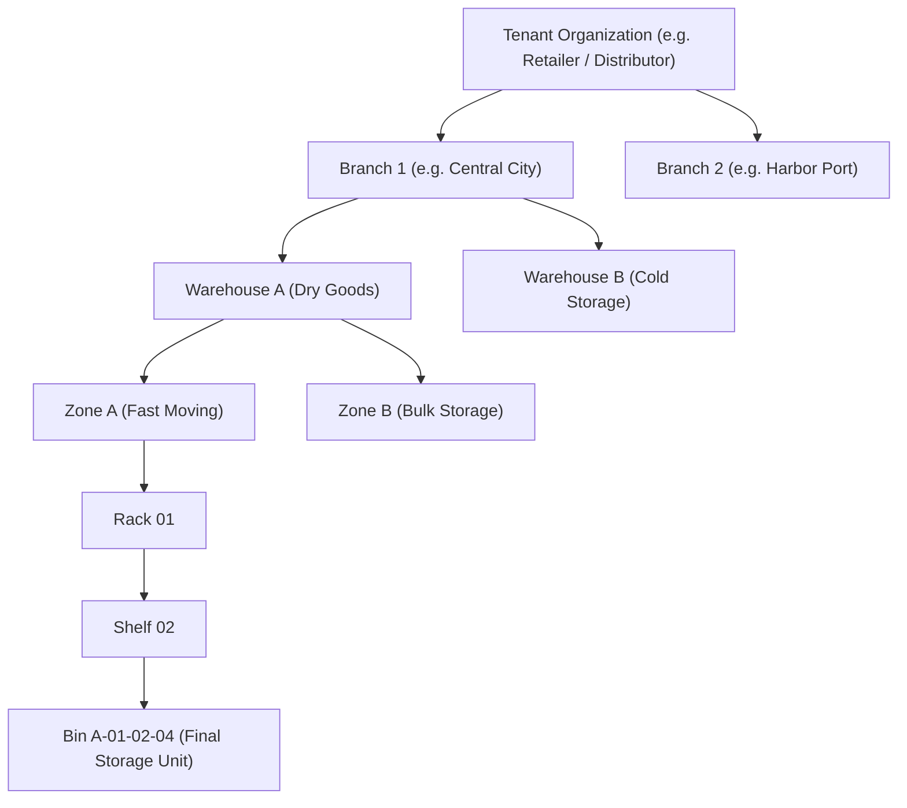

# AeroWMS — Client Presentation & System Overview Guide
> **The Complete Explainer, Sales Pitch & Demo Script for Potential Clients & Stakeholders**

---

## 📌 Executive Summary (The 30-Second Pitch)

**AeroWMS** is an enterprise-grade, cloud-ready **Intelligent Warehouse Management System** designed to give businesses 100% real-time visibility and control over their multi-branch inventory. 

Built with modern **Spring Boot 3** and **Angular 18**, AeroWMS transforms traditional, chaotic warehouse operations into streamlined, digital workflows. It eliminates stockouts, prevents costly batch expirations through **FEFO (First-Expired-First-Out)** intelligence, pinpoints items down to the exact **Bin location**, and enables **camera barcode scanning** right from smartphones and laptops without requiring expensive dedicated hardware.

---

## 🎯 The Core Business Problems AeroWMS Solves

When speaking to potential clients, first identify their operational pain points:

| Typical Client Pain Point | How AeroWMS Solves It |
| :--- | :--- |
| **"We lose money because items expire on the shelf."** | **Automated FEFO (First-Expired, First-Out):** The system automatically prioritizes and dispatches items expiring first, alerting staff 30 days before expiry. |
| **"Staff spend too much time searching for items."** | **5-Level Hierarchical Storage:** Every SKU is mapped to **Warehouse → Zone → Rack → Shelf → Bin**. Staff know the exact aisle and bin instantly. |
| **"Stock records in Excel don't match physical stock."** | **Real-Time Digital Movements & Audits:** Every Stock In, Stock Out, Transfer, and Adjustment is logged with time, user, and approval tracking. |
| **"Managing inventory across multiple branches is a headache."** | **Multi-Branch & Inter-Warehouse Transfers:** Centralized visibility across all branches with a formal dispatch-and-receipt transfer pipeline. |
| **"Specialized barcode scanners are too expensive."** | **Built-in Optical Camera Scanner:** Any smartphone, tablet, or webcam acts as an optical barcode/QR reader, alongside support for standard USB/Bluetooth laser guns. |
| **"We fail audits or can't trace who changed what."** | **Immutable Audit Logs:** An unalterable digital paper trail tracks every login, stock edit, approval, and transaction. |

---

## 🏗️ System Architecture & Organization Hierarchy

AeroWMS models your business exactly as it operates in the real world:



### The 5-Level Storage Hierarchy:
1. **Branch**: Regional division or city facility.
2. **Warehouse**: Physical facility (e.g., Central Hub, Cold Storage).
3. **Zone**: Specific operational area (e.g., Receiving, Cold Room, High-Value).
4. **Rack**: Structural aisle or shelving frame.
5. **Shelf & Bin**: The granular compartment where products physically sit with unique identification codes.

---

## 🌟 Key Modules & Functional Capabilities

### 1. Multi-Tenant Enterprise Isolation
- **Strict Data Security**: Each client organization's data is strictly partitioned. No client can ever see another client’s catalog, warehouses, or transactions.
- **Central SaaS Management**: A dedicated Platform Super-Admin console to onboard new clients, monitor system health, and manage subscriptions.

### 2. Intelligent FEFO Batch & Expiry Management
- **Batch Tracking**: Every inbound shipment is assigned a specific Batch Number, Manufacturing Date, and Expiry Date.
- **Automated Dispatch Recommendation**: When creating a Stock Out or order dispatch, AeroWMS automatically recommends the batch expiring soonest (**FEFO**), drastically cutting down expired inventory write-offs.
- **30-Day Early Warning**: Real-time alerts on the dashboard flag items approaching expiry within 30 days.

### 3. Comprehensive Stock Operations
- **Stock In (Receiving & Putaway)**: Record supplier deliveries, generate or scan barcodes, attach purchase order references, and assign items to their target bins.
- **Stock Out (Fulfillment & Dispatch)**: Pick and pack inventory with automated batch deductions and real-time inventory decrement.
- **Stock Transfers (Inter-Branch / Inter-Warehouse)**: A robust multi-step workflow (`PENDING` ➔ `COMPLETED`) ensuring goods leaving one warehouse are accounted for before arriving at the destination.
- **Stock Adjustments (Cycle Counts & Shrinkage)**: Built-in maker-checker approval for physical stock count corrections, damaged items, or shrinkage reconciliation.

### 4. Zero-Hardware Optical Barcode & QR Scanner
- **Camera-Based Scanning**: Uses `html5-qrcode` to scan product barcodes and location QR codes directly using device webcams or mobile cameras.
- **Hardware Agnostic**: Seamlessly works with traditional USB and Bluetooth laser barcode guns with keyboard wedge emulation.
- **Instant Telemetry**: Point the scanner at any product to immediately display available stock, batch details, bin location, and reorder levels.

### 5. Executive Dashboard & Live Business Intelligence
- **High-Level KPIs**: Real-time cards displaying Total Products, On-Hand Units, Warehouses, Active Branches, Low Stock alerts, and Expiring Soon counts.
- **Visual Trends**: Interactive Chart.js graphs showing a **7-Day Movement Timeline** (Inbound vs Outbound velocity) and **Warehouse Stock Distribution**.
- **Live Activity Stream**: Real-time telemetry feed of warehouse transactions as they happen on the ground.

### 6. Audit-Ready PDF & Excel Reports
- **PDF Inventory Balances Report**: Formatted A4 landscape document showing item codes, categories, bin locations, batch expiration dates, and quantities.
- **Excel Stock Movements Ledger (.xlsx)**: Complete transactional ledger suitable for financial reconciliations, tax compliance, and physical audits.

### 7. Granular Role-Based Access Control (RBAC)
- **`PLATFORM_ADMIN`**: Full cloud infrastructure and tenant management.
- **`CLIENT_ADMIN`**: Company executives managing organization settings, branches, users, and audit logs.
- **`BRANCH_MANAGER`**: Warehouse and branch operational supervisors.
- **`WAREHOUSE_STAFF`**: Ground-level pickers, packers, and receiving clerks.
- **`VIEWER`**: Read-only access for auditors and executive reviewers.

---

## 🔄 Daily Workflow in Action (How it Works on the Ground)

```mermaid
sequenceDiagram
    autonumber
    actor Supplier as Supplier / Delivery
    actor Staff as Warehouse Staff
    participant System as AeroWMS System
    actor Customer as Customer / Dispatch

    Note over Supplier,Staff: INBOUND WORKFLOW
    Supplier->>Staff: Delivers goods with PO / Invoice
    Staff->>System: "Stock In" with Batch No & Expiry Date
    Staff->>System: Assign to Warehouse -> Zone -> Bin (Optical Scan)
    System-->>Staff: Stock updated instantly & bin location saved

    Note over Staff,Customer: OUTBOUND WORKFLOW
    Customer->>System: Sales / Dispatch Request created
    System-->>Staff: Automated FEFO Suggestion (Pick oldest batch first)
    Staff->>System: Scan barcode to verify item & confirm "Stock Out"
    System-->>Customer: Dispatch confirmed; stock balance auto-reduced
```

---

## 💰 Business Value & Return on Investment (ROI)

When pitching to management or business owners, focus on numbers and cost savings:

1. **Reduce Expiry Losses by up to 75%**: With automated FEFO dispatching, perishable items and date-sensitive goods are sold before they go bad.
2. **Double Picking & Packing Speed**: Pickers walk straight to the exact Bin (`A-01-02-04`) instead of wandering through aisles searching for boxes.
3. **99.8% Inventory Accuracy**: Eliminates phantom inventory and human counting errors through barcode verification.
4. **Zero Upfront Hardware Investment**: Warehouses do not need to spend thousands of dollars on expensive RF terminals; supervisors and staff can use existing mobile devices or affordable Android tablets.
5. **Fast Onboarding**: Intuitive modern interface designed for warehouse staff with minimal computer training.

---

## 🗣️ Client Presentation Script (How to Pitch AeroWMS)

### Option A: The 2-Minute Elevator Pitch
> *"Managing warehouses across branches using spreadsheets or disconnected software always leads to three things: lost stock, expired goods, and delayed orders.*
>
> *We built **AeroWMS** to eliminate these problems completely. It is an intelligent, multi-tenant warehouse system that tracks your inventory down to the exact shelf and bin.*
> 
> *Our system automatically recommends the oldest batch first—saving you from costly expiry write-offs—and gives you instant barcode scanning through any smartphone or laptop camera. Whether you have one central facility or ten regional branches, AeroWMS gives your executives real-time visibility, automated reports in PDF and Excel, and a foolproof audit trail."*

### Option B: The Step-by-Step Live Demo Flow (10 Minutes)
1. **Show the Executive Dashboard (1 min)**:
   - Highlight the KPI cards: Total stock, low stock warnings, items expiring in 30 days.
   - Show the 7-day movement chart (Stock In vs Stock Out).
2. **Demonstrate Hierarchical Setup (2 mins)**:
   - Navigate to **Warehouses & Branches**.
   - Show how a warehouse breaks down into **Zones ➔ Racks ➔ Shelves ➔ Bins**.
   - *Message to client*: "Your staff will never ask 'Where is this item stored?' ever again."
3. **Demonstrate Receiving / Stock In (2 mins)**:
   - Create a Stock In transaction.
   - Enter Product, Batch Number, and Expiry Date, then pick a target bin.
4. **Demonstrate Live Barcode Scanner (2 mins)**:
   - Open the **Scanner** module.
   - Point the camera at a product barcode or enter a code. Show the instant real-time telemetry card popping up with stock levels and location.
5. **Demonstrate FEFO Stock Out (2 mins)**:
   - Initiate a Stock Out.
   - Show how AeroWMS automatically flags and recommends the batch expiring soonest.
6. **Show Reports & Audit Trail (1 min)**:
   - Click to download the **PDF Inventory Balance Report** and **Excel Movement Ledger**.
   - Show the **Audit Logs** to demonstrate accountability (who logged in, who adjusted stock).

---

## ❓ Frequently Asked Questions (Customer Q&A)

#### Q1: "We have multiple branches in different cities. Can this system handle that?"
> **Answer**: Yes, absolutely. AeroWMS is built with a multi-branch architecture. You can set up unlimited branches and warehouses, track stock levels individually for each location, and use our **Stock Transfer** module to move items between branches with full transit tracking.

#### Q2: "Do we have to buy expensive handheld barcode scanners?"
> **Answer**: No. AeroWMS features a built-in optical camera scanner. Your team can use the camera on any smartphone, tablet, or laptop. If your warehouse already has standard USB or Bluetooth barcode guns, AeroWMS supports them seamlessly as well.

#### Q3: "How does the system prevent products from expiring?"
> **Answer**: AeroWMS enforces **FEFO (First-Expired, First-Out)**. Every batch has an expiration date. When picking stock for customer orders, the system automatically recommends the batch expiring earliest. Furthermore, the dashboard maintains a proactive 30-day expiry warning list.

#### Q4: "Is our business data secure?"
> **Answer**: Yes. AeroWMS uses a secure **Multi-Tenant architecture** with Spring Security 6 and stateless JWT token authentication. Your organization's data is completely isolated from other tenants at the database query layer. Only users you invite and authorize with specific roles can access your workspace.

#### Q5: "Can we export data for accounting or tax audits?"
> **Answer**: Yes. With a single click, you can generate formatted **PDF Inventory Audit Reports** and full **Excel (.xlsx) Stock Ledgers** showing all historical inflows, outflows, and adjustments.

#### Q6: "How difficult is it for our warehouse workers to learn?"
> **Answer**: AeroWMS was built with a clean, high-contrast, modern UI that minimizes input fatigue. Most warehouse workers learn the receiving, scanning, and dispatching steps in less than 30 minutes of hands-on training.

---

## 💻 Technical Specifications

- **Backend Architecture**: Java 17, Spring Boot 3.x, Spring Data JPA, Hibernate, Spring Security 6 (JWT)
- **Frontend Architecture**: Angular 18 (Standalone Components, Reactive Signals, RxJS)
- **Design & UI**: Bootstrap 5.3, Bootstrap Icons, Chart.js, Animated Camera Laser Viewfinder
- **Scanning Technology**: HTML5 Optical Video Stream Engine (`html5-qrcode`) + Laser Wedge Emulation
- **Reporting Engine**: OpenPDF / iText PDF Generation & Apache POI Excel Workbook Export
- **Database Support**: PostgreSQL (Production) / H2 (Development & Testing)
- **Deployment**: Docker containerization ready, Cloud VM / On-Premise compatible
