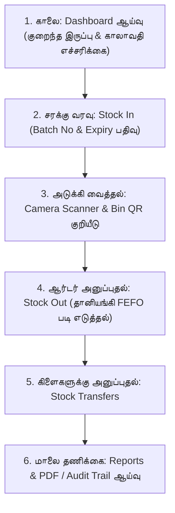

# AeroWMS — பக்க மெனு (Side Bar) முழுமையான பயனர் கையேடு & விளக்க உரை
> **Zains Cuisine மற்றும் பல்-கிளை வணிகங்களுக்கான விரிவான வழிகாட்டி (Detailed User Manual in Tamil)**

---

## 📌 அறிமுகம் (Overview)

**AeroWMS** என்பது உங்கள் நிறுவனத்தின் அனைத்து கிடங்குகள் (Warehouses) மற்றும் கிளைகளின் (Branches) சரக்குகளைத் துல்லியமாகக் கண்காணிக்கும் அதிநவீன மென்பொருளாகும்.

மொபைல் திரையில் இடதுபுறம் உள்ள **Side Bar (பக்க மெனு)** உங்கள் கிடங்கு நடவடிக்கைகளை 4 பிரதான பிரிவுகளாகப் பிரிக்கிறது:
1. **OPERATIONS (செயல்பாடுகள் மேலாண்மை)**
2. **LOGISTICS (சரக்கு போக்குவரத்து & நகர்வுகள்)**
3. **STRUCTURE (கிடங்கு மற்றும் கிளைக் கட்டமைப்பு)**
4. **ENTERPRISE (நிறுவன தணிக்கை மற்றும் குழு நிர்வாகம்)**

கீழே ஒவ்வொரு மெனுவும் **என்ன**, **எதற்கு பயன்படுகிறது**, மற்றும் **எவ்வாறு பயன்படுத்துவது** என்பது நிஜ வாழ்க்கை உதாரணங்களுடன் விரிவாக விளக்கப்பட்டுள்ளது.

---

## ⚡ பிரிவு 1: OPERATIONS (செயல்பாடுகள் மேலாண்மை)

### 1. 📊 Dashboard (டாஷ்போர்டு - கட்டுப்பாட்டு மையம்)
* **என்ன இது?**: உங்கள் கிடங்கு மற்றும் கிளைகளின் அனைத்து நடவடிக்கைகளையும் ஒரே திரையில் நேரலையாகப் பார்க்கும் கட்டுப்பாட்டு மையம் (Live Telemetry Cockpit).
* **எதற்கு பயன்படுகிறது?**:
  * **மொத்த இருப்பை அறிய:** மொத்த பொருட்கள் (Total Products), நடப்பு இருப்பு (On-Hand Units), இயங்கும் கிளைகள் மற்றும் கிடங்குகளின் எண்ணிக்கையை உடனடியாகத் தெரிந்துகொள்ள.
  * **அபாய எச்சரிக்கைகள் (Alerts):** இருப்பு தீர்ந்துபோகும் நிலையில் உள்ள பொருட்கள் (**Low Stock Alerts**) மற்றும் அடுத்த 30 நாட்களுக்குள் காலாவதியாக உள்ள பொருட்கள் (**Expiring in 30 Days**) ஆகியவற்றை உடனே காட்டி இழப்புகளைத் தடுக்க.
  * **இயக்க வரைபடங்கள்:** கடந்த 7 நாட்களில் எவ்வளவு சரக்கு உள்ளே வந்தது (Stock In) மற்றும் எவ்வளவு வெளியே சென்றது (Stock Out) என்பதை வரைபடமாகப் பார்க்க.
* **எப்படி பயன்படுத்துவது?**:
  1. Side Bar-இல் **Dashboard** கிளிக் செய்யவும்.
  2. திரையின் மேற்பகுதியில் உள்ள கலர் கார்டுகளைப் பார்க்கவும். ஏதேனும் எச்சரிக்கைகள் (மஞ்சள்/சிவப்பு) இருந்தால் உடனடியாக கவனியுங்கள்.
  3. கீழே உள்ள வரைபடங்கள் மூலம் தினசரி சரக்கு ஓட்டத்தைக் கண்காணிக்கவும்.
* **நிஜ வாழ்க்கை உதாரணம் (Zains Cuisine)**: உங்கள் கிடங்கில் 'பாஸ்மதி அரிசி' 10 மூட்டைகளுக்குக் குறைவாக இருந்தால், அல்லது 'சீஸ்/பால்' இன்னும் 4 நாட்களில் காலாவதியாகப் போகிறது என்றால் டாஷ்போர்டு உடனே எச்சரிக்கும்.

---

### 2. 📦 Products & Catalog (பொருட்கள் பட்டியல் & அட்டவணை)
* **என்ன இது?**: உங்கள் நிறுவனத்தில் விற்கப்படும் அல்லது கையாளப்படும் அனைத்து தயாரிப்புகளின் முதன்மை விபரக் களஞ்சியம் (Master Product Catalog).
* **எதற்கு பயன்படுகிறது?**:
  * புதிய பொருட்களை கணினியில் சேர்க்க (Product Name, SKU குறியீடு, பிராண்ட், வகை/Category).
  * பொருட்களுக்கான **Barcode / QR Code** எண்களை இணைக்க (கேமராவில் ஸ்கேன் செய்ய இது மிகவும் அவசியம்).
  * அடக்க விலை (Cost Price), விற்பனை விலை (Selling Price) மற்றும் குறைந்தபட்ச இருப்பு வரம்பை (**Reorder Level**) நிர்ணயிக்க.
  * நூற்றுக்கணக்கான பொருட்களை Excel மூலம் ஒரே கிளிக்கில் பதிவேற்ற (Excel Import / Export).
* **எப்படி பயன்படுத்துவது?**:
  1. Side Bar-இல் **Products & Catalog** கிளிக் செய்யவும்.
  2. புதிய பொருளைச் சேர்க்க மேலே உள்ள **"Add Product"** நீல பட்டனை அழுத்தவும்.
  3. திறக்கும் படிவத்தில்:
     * *Product Name* (எ.கா: Biryani Basmati Rice 5kg)
     * *SKU* (தனித்துவ குறியீடு: RICE-BAS-001)
     * *Barcode* (பாக்கெட்டில் உள்ள பார்கோடு எண்: 8901234560011)
     * *Reorder Level* (எ.கா: 15) ஆகியவற்றை உள்ளிட்டு **"Save Product"** கொடுக்கவும்.
  4. பொருட்களைத் தேட மேல் உள்ள Search Bar-இல் பெயர் அல்லது பார்கோடை டைப் செய்யலாம்.

---

### 3. 📑 Inventory & FEFO (சரக்கு இருப்பு & காலாவதி கண்காணிப்பு)
* **என்ன இது?**: எந்த கிடங்கில், எந்த அலமாரியில் (Bin), எந்த பேட்சில் (Batch) எவ்வளவு சரக்கு உள்ளது என்பதை காலாவதி தேதியுடன் காட்டும் நேரடி இருப்பு அட்டவணை.
* **எதற்கு பயன்படுகிறது?**:
  * **FEFO (First-Expired, First-Out) மேலாண்மை:** எந்த பேட்ச் முதலில் காலாவதியாகிறதோ, அதை முதலில் அடையாளம் கண்டு விற்க/பயன்படுத்த உதவுகிறது. இதனால் காலாவதியாகும் உணவுகளால் ஏற்படும் நஷ்டம் முற்றிலுமாகத் தவிர்க்கப்படுகிறது.
  * **காலாவதி வண்ண எச்சரிக்கைகள் (Color Heatmap):**
    * 🟢 **பச்சை**: நீண்ட காலம் காலாவதி உள்ள நல்ல பொருட்கள்.
    * 🟡 **மஞ்சள்**: அடுத்த 30 நாட்களுக்குள் காலாவதியாகப் போகும் பொருட்கள்.
    * 🔴 **சிவப்பு**: காலாவதியான பொருட்கள் (உடனடியாக அகற்றப்பட வேண்டும்).
* **எப்படி பயன்படுத்துவது?**:
  1. Side Bar-இல் **Inventory & FEFO** என்பதைத் தேர்ந்தெடுக்கவும்.
  2. *Warehouse Filter*-இல் நீங்கள் பார்க்க விரும்பும் கிடங்கைத் தேர்ந்தெடுக்கவும் (எ.கா: Main Warehouse).
  3. Search பெட்டியில் பொருளின் பெயர் அல்லது Batch Number-ஐ டைப் செய்து வடிகட்டலாம்.
  4. எச்சரிக்கை உள்ள பேட்ச்களை அடையாளம் கண்டு உடனே விற்க நடவடிக்கை எடுக்கலாம்.

---

### 4. 📷 Camera Scanner (ஆப்டிகல் கேமரா பார்-கோட் & QR ஸ்கேனர்)
* **என்ன இது?**: பிரத்யேக பார்கோடு மெஷின்கள் தேவையின்றி, உங்கள் ஸ்மார்ட்போன் அல்லது லேப்டாப் கேமராவைப் பயன்படுத்தி பார்கோடுகளை நொடிப் பொழுதில் ஸ்கேன் செய்யும் வசதி.
* **எதற்கு பயன்படுகிறது?**:
  * **உடனடி தகவல் (Item Telemetry):** ஒரு பொருளின் மீது கேமராவைக் காட்டியவுடன், அதன் தற்போதைய இருப்பு (Available Stock), விலை, மற்றும் சேமிப்பு இடம் (Bin) திரையில் தோன்றும்.
  * **வேகமான வேலை:** பணியாளர்கள் தட்டச்சு செய்யாமல் பார்கோடை ஸ்கேன் செய்து உடனடியாக **Stock In** அல்லது **Stock Out** செய்ய முடியும்.
* **எப்படி பயன்படுத்துவது?**:
  1. Side Bar-இல் ஒளிரும் **Camera Scanner** பொத்தானை அழுத்தவும் (அல்லது மேல் வலது மூலையில் உள்ள மஞ்சள் கேமரா ஐகானைத் தொடவும்).
  2. மொபைலில் 'Allow Camera' கேட்கும்போது அனுமதி கொடுக்கவும்.
  3. திரையில் தோன்றும் பச்சை லேசர் கட்டத்திற்குள் பார்கோடை வைக்கவும்.
  4. ஸ்கேன் ஆனதும் **"MATCH CONFIRMED"** என்று தோன்றி விவரங்கள் வரும். அங்கிருந்தே நேரடியாக **Stock In** அல்லது **Stock Out** செய்யலாம்.
  * *(குறிப்பு: கேமரா வேலை செய்யாதபோது கீழே உள்ள 'Manual Code Input' பெட்டியில் பார்கோடு எண்ணை தட்டச்சு செய்யலாம்).*

---

## 🚚 பிரிவு 2: LOGISTICS (சரக்கு போக்குவரத்து & நகர்வுகள்)

### 5. 🔄 Stock In / Out (சரக்கு வரவு மற்றும் விநியோகம்)
* **என்ன இது?**: கிடங்கிற்குள் சரக்குகள் உள்ளே வரும்போதும் (Inbound) அல்லது ஆர்டர்களுக்காக வெளியே செல்லும்போதும் (Outbound) பதிவு செய்யும் முக்கிய பகுதி.
* **எதற்கு பயன்படுகிறது?**:
  * **Stock In (வரவு):** சப்ளையர்களிடமிருந்து சரக்கு டெலிவரி வரும்போது, Purchase Order/GRN எண், Batch எண், தயாரிப்பு தேதி, காலாவதி தேதி மற்றும் கிடங்கு விபரங்களுடன் பதிவு செய்ய.
  * **Stock Out (விநியோகம்):** சரக்குகளை விற்பனைக்கு அனுப்பும்போது பதிவு செய்ய.
  * **தானியங்கி FEFO பரிந்துரை:** நீங்கள் Stock Out செய்யும்போது, கணினி தானாகவே *"முதலில் காலாவதியாகும் பேட்ச் இதுதான், இதிலிருந்து எடுங்கள்"* என்று பரிந்துரைத்து இருப்பைக் கழிக்கும்.
* **எப்படி பயன்படுத்துவது?**:
  * **Stock In செய்ய:** 'Stock In' தேர்வு செய்து ➔ பொருள் பெயர் ➔ கிடங்கு ➔ வரவு அளவு ➔ Batch எண் ➔ Expiry Date கொடுத்து **"Confirm Stock In"** அழுத்தவும்.
  * **Stock Out செய்ய:** 'Stock Out' தேர்வு செய்து ➔ பொருள் பெயர் ➔ அனுப்பும் அளவு கொடுத்து **"Confirm Dispatch Out"** அழுத்தவும்.

---

### 6. 🚛 Stock Transfers (கிளைகளுக்கு இடையிலான இடமாற்றம்)
* **என்ன இது?**: உங்கள் நிறுவனத்திற்கு சொந்தமான ஒரு கிடங்கிலிருந்து மற்றொரு கிடங்கிற்கு (அல்லது கிளைக்கு) பாதுகாப்பாக சரக்குகளை இடமாற்றம் செய்யும் முறை.
* **எதற்கு பயன்படுகிறது?**:
  * வழியில் சரக்கு காணாமல் போவதைத் தடுத்து, முழு கண்காணிப்புடன் இடமாற்றம் செய்ய.
  * 4-நிலை பாதுகாப்பு நிலைகள்: `PENDING` ➔ `APPROVED` ➔ `DISPATCHED` ➔ `COMPLETED`.
* **எப்படி பயன்படுத்துவது?**:
  1. **Stock Transfers** கிளிக் செய்து **"New Transfer Request"** அழுத்தவும்.
  2. அனுப்பும் கிடங்கு (Source) மற்றும் பெறும் கிடங்கு (Destination)-ஐத் தேர்வு செய்து அளவைக் குறிப்பிடவும் (Status: `PENDING`).
  3. மேலாளர் **"Approve"** செய்தபின், லாரி புறப்படும்போது **"Dispatch"** அழுத்தவும்.
  4. சரக்கு இலக்கை அடைந்ததும் சரிபார்த்து **"Receive"** அழுத்தினால் இடமாற்றம் பூர்த்தியாகும்.

---

### 7. 📋 Adjustments (இருப்பு திருத்தம் & கணக்கெடுப்பு சரிசெய்தல்)
* **என்ன இது?**: நேரடி கிடங்கு கணக்கெடுப்பின் போது (Physical Count) கணினியில் உள்ள எண்ணிக்கைக்கும் நேரில் உள்ள எண்ணிக்கைக்கும் வித்தியாசம் இருந்தால் அல்லது சேதமடைந்தால் அதை சரிசெய்யும் பகுதி.
* **எதற்கு பயன்படுகிறது?**:
  * உடைந்த பொருட்கள் (Damaged), காலாவதியான பொருட்கள் (Expired write-off) போன்றவற்றை கணக்கிலிருந்து கழிக்க.
  * நிர்வாக ஒப்புதல் (Approval) இன்றி யாரும் இருப்பை மாற்றிவிட முடியாது.
* **எப்படி பயன்படுத்துவது?**:
  1. **Adjustments** கிளிக் செய்து **"Report Discrepancy"** அழுத்தவும்.
  2. பொருள், கிடங்கு, நேரில் எண்ணிய அளவு (Physical Quantity), மற்றும் காரணத்தைத் தேர்ந்தெடுக்கவும்.
  3. மேலாளர் பரிசீலித்து ஒப்புதல் அளித்தவுடன் கணினியில் இருப்பு திருத்தப்படும்.

---

## 🏛️ பிரிவு 3: STRUCTURE (கிடங்கு மற்றும் கிளைக் கட்டமைப்பு)

### 8. 🏗️ Spatial Warehouses (5-அடுக்கு துல்லிய கிடங்கு கட்டமைப்பு)
* **என்ன இது?**: கிடங்கை நிஜ உலகில் இருப்பது போலவே 5 நிலைகளாகப் பிரிக்கும் பகுதி: **Warehouse ➔ Zone ➔ Rack ➔ Shelf ➔ Bin**.
* **எதற்கு பயன்படுகிறது?**:
  * ஊழியர்கள் சரக்கைத் தேடி அலைவதைத் தடுத்து, "இந்த பொருள் Zone A-வில் உள்ள Rack 01, Shelf 02, Bin 04-இல் உள்ளது" என்பதைத் துல்லியமாக அறிய.
  * ஒவ்வொரு Bin-க்கும் பிரத்யேக QR Code உருவாக்கி ஒட்டலாம்.
* **எப்படி பயன்படுத்துவது?**:
  1. **Spatial Warehouses** கிளிக் செய்து புதிய கிடங்கை உருவாக்க **"Add Warehouse"** அழுத்தவும்.
  2. பின் அதன் உள்ளே **Zone** (எ.கா: Cold Room), **Rack** (வரிசை), மற்றும் **Bin** (பெட்டி) ஆகியவற்றைச் சேர்க்கவும்.

---

### 9. 📍 Branches (கிளைகள் மேலாண்மை)
* **என்ன இது?**: உங்கள் நிறுவனத்தின் பல்வேறு நகரக் கிளைகள், உணவகங்கள் அல்லது விற்பனை மையங்களை நிர்வகிக்கும் பகுதி.
* **எதற்கு பயன்படுகிறது?**:
  * ஒவ்வொரு கிளைக்கும் தனித்தனி கிடங்குகளை ஒதுக்கவும், கிளை வாரியாக விற்பனை மற்றும் இருப்புகளைப் பிரித்துக் கண்காணிக்கவும்.
* **எப்படி பயன்படுத்துவது?**:
  1. **Branches** கிளிக் செய்து **"Add Branch"** அழுத்தவும்.
  2. கிளை பெயர், குறியீடு (Branch Code), முகவரி ஆகியவற்றை உள்ளிட்டு சேமிக்கவும்.

---

## 🏢 பிரிவு 4: ENTERPRISE (நிர்வாகம், தணிக்கை & அறிக்கைகள்)

### 10. 📑 Reports & PDF (அறிக்கைகள் & பிடிஎஃப் / எக்செல் ஆவணங்கள்)
* **என்ன இது?**: கிடங்கின் இருப்பு மற்றும் வரலாற்றுப் பதிவுகளை அதிகாரப்பூர்வ ஆவணங்களாகப் பதிவிறக்கும் பகுதி.
* **எதற்கு பயன்படுகிறது?**:
  * **Inventory Balances Report (PDF):** தணிக்கை அல்லது மேலாண்மைக்குத் தேவையான நேர்த்தியான A4 Landscape PDF அறிக்கை.
  * **Stock Movements Ledger (Excel .xlsx):** வரவு-செலவு மற்றும் வரி கணக்கீட்டிற்கான முழுமையான எக்செல் கோப்பு.
* **எப்படி பயன்படுத்துவது?**:
  1. **Reports & PDF** பக்கத்திற்குச் செல்லவும்.
  2. PDF-க்கு **"Download PDF Report"** (சிவப்பு பட்டன்) அல்லது Excel-க்கு **"Download Excel Spreadsheet"** (பச்சை பட்டன்) கிளிக் செய்யவும்.

---

### 11. 👥 Team & Roles (பணியாளர்கள் & அனுமதி நிலைகள் / RBAC)
* **என்ன இது?**: ஊழியர்களுக்கு கணக்கு உருவாக்கி, அவர்களின் வேலைக்குத் தேவையான அதிகாரங்களை மட்டும் வழங்கும் பகுதி.
* **எதற்கு பயன்படுகிறது?**:
  * அதிகார நிலைகள்:
    * `CLIENT_ADMIN`: நிறுவன உரிமையாளர் (முழு அதிகாரம்).
    * `BRANCH_MANAGER`: கிளை மேலாளர் (சரக்கு வரவு, மாற்றங்களை அங்கீகரிப்பவர்).
    * `WAREHOUSE_STAFF`: களப் பணியாளர்கள் (ஸ்கேனிங், Stock In/Out மட்டுமே செய்ய முடியும்).
    * `VIEWER`: பார்வையாளர் (இருப்புகளைப் பார்க்க மட்டுமே முடியும்).
* **எப்படி பயன்படுத்துவது?**:
  1. **Team & Roles** கிளிக் செய்து **"Invite User"** அழுத்தவும்.
  2. பெயர், மின்னஞ்சல், கடவுச்சொல் மற்றும் Role-ஐத் தேர்ந்தெடுத்து சேமிக்கவும்.

---

### 12. 🛡️ Audit Trail (பாதுகாப்பு & தணிக்கைப் பதிவு)
* **என்ன இது?**: கணினியில் யார் என்ன செய்தார்கள் என்பதை நொடி விடாமல் பதிவு செய்யும் மாற்ற முடியாத பாதுகாப்புப் பதிவேடு (Immutable Security Log).
* **எதற்கு பயன்படுகிறது?**:
  * யார் லாக்-இன் செய்தார்கள், யார் சரக்கை மாற்றினார்கள் என்பதை தேதி, நேரம், மற்றும் கணினி **IP முகவரியுடன்** துல்லியமாகக் காட்டி முறைகேடுகளைத் தடுக்க.
* **எப்படி பயன்படுத்துவது?**:
  1. **Audit Trail** பக்கத்திற்குச் சென்று சந்தேகத்திற்கிடமான மாற்றங்களை காலவரிசைப்படி ஆய்வு செய்யலாம்.

---

## ⚡ விரைவு அம்சங்கள் (Header & Profile)

| அம்சம் | எதற்கு பயன்படுகிறது? | எவ்வாறு இயக்குவது? |
| :--- | :--- | :--- |
| **Quick Camera Scan** | எந்த பக்கத்தில் இருந்தாலும் உடனே பார்கோடை ஸ்கேன் செய்ய. | மேல் வலது மூலையில் உள்ள மஞ்சள் **கேமரா ஐகானைத்** தொடவும். |
| **Notification Bell** | குறைந்த இருப்பு மற்றும் காலாவதி எச்சரிக்கைகளைப் பார்க்க. | மேல் உள்ள **மணி ஐகானைத்** தொட்டு எச்சரிக்கைகளைப் பார்க்கவும். |
| **User Profile & Logout** | உள்நுழைந்துள்ள பயனர் பெயர் (Zainab Faris) மற்றும் வெளியேற. | Side bar-இன் கீழ் உள்ள உங்கள் பெயருக்கு அருகில் உள்ள **Logout** பட்டனை அழுத்தவும். |

---

## 🔄 தினசரி கிடங்கு செயல்பாட்டுப் படிநிலைகள் (Daily Workflow)

