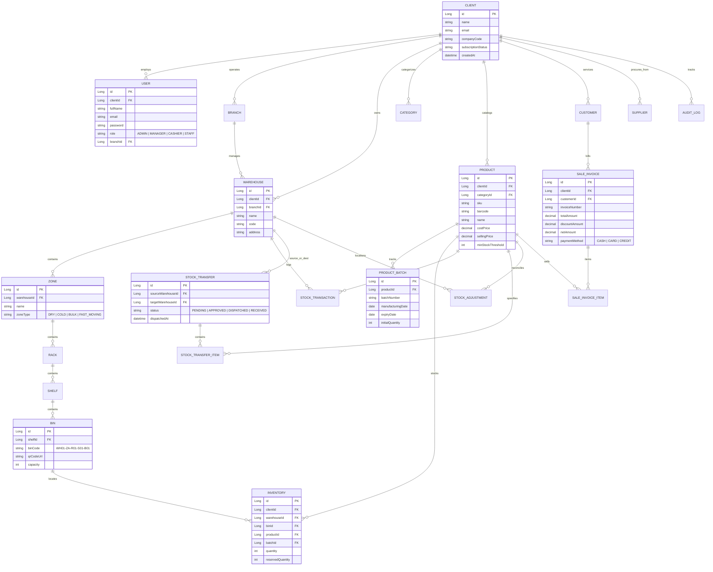
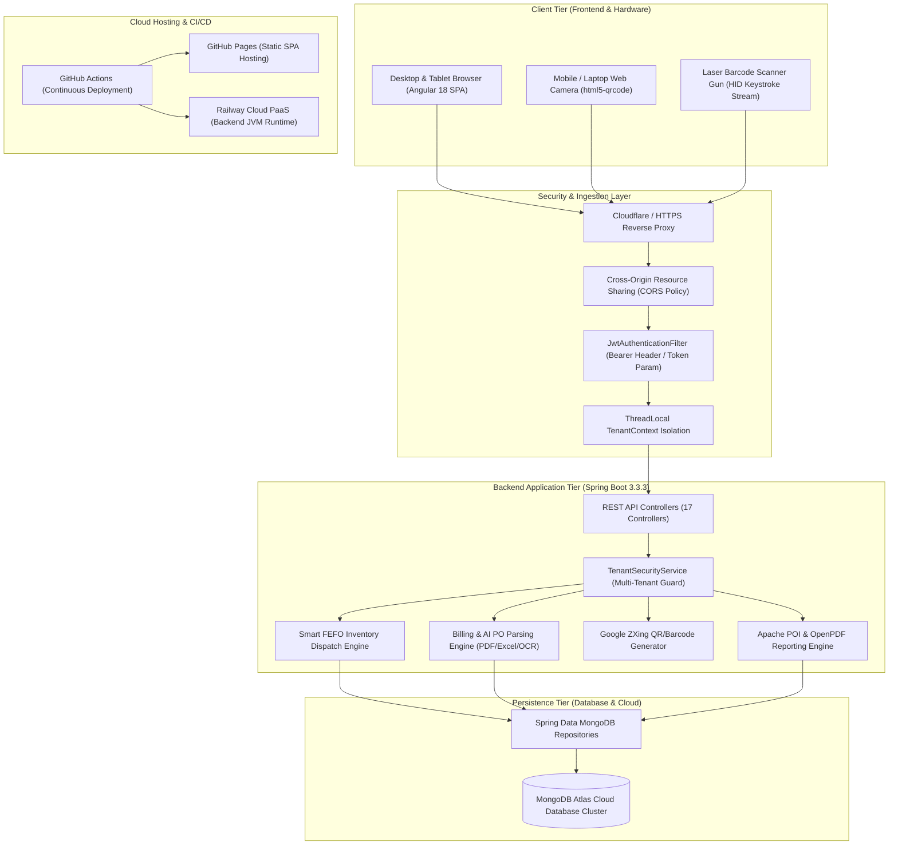

# AeroWMS - Comprehensive Technical Project Submission Portfolio

> **Prepared for:** Technical HR & Evaluation Committee  
> **Project Title:** AeroWMS – Intelligent Multi-Tenant Warehouse Management & Point-of-Sale System  
> **Author / Lead Engineer:** Izza Faris  
> **Target Industry:** SME Warehouses, Retail Chains, 3PL Logistics Providers & Distribution Hubs  

---

## 2. GitHub Repository Link with Complete Source Code

* **GitHub Repository URL:** [https://github.com/izza-faris/WMS-SYSTEM](https://github.com/izza-faris/WMS-SYSTEM)
* **Default Branch:** `main`
* **Live Web Application (Frontend):** [https://izza-faris.github.io/WMS-SYSTEM/](https://izza-faris.github.io/WMS-SYSTEM/)
* **Live Cloud REST API (Backend):** [https://wms-system-production-e062.up.railway.app/api/v1](https://wms-system-production-e062.up.railway.app/api/v1)
* **API Health Endpoint:** [https://wms-system-production-e062.up.railway.app/api/health](https://wms-system-production-e062.up.railway.app/api/health)

---

## 3. Project Overview & Documentation

**AeroWMS** is an enterprise-grade, multi-tenant Warehouse Management and POS platform engineered to solve inventory shrinkage, expiry losses, picking inefficiencies, and cross-branch logistics fragmentation.

### Key Business Problems Solved:
1. **Perishability & Expiration Losses:** Solved using an automated **FEFO (First-Expired-First-Out)** algorithm that enforces picking from the earliest expiring batches.
2. **Multi-Tenant Data Privacy:** Strict tenant isolation at database and application levels guarantees zero data leakage across organizations.
3. **Warehouse Navigation Inefficiencies:** A 5-tier spatial hierarchy (**Warehouse ➔ Zone ➔ Rack ➔ Shelf ➔ Bin**) with automated QR code bin tagging.
4. **Hardware Cost Barrier:** Web-based camera barcode decoding removes the need for expensive dedicated handheld hardware scanners.
5. **Slow Counter Sales:** Integrated Point of Sale (POS) counter with instant barcode scanning, AI Purchase Order (PO) document ingestion (PDF, Excel, Images), and automated stock deduction.

---

## 4. Database ER (Entity-Relationship) Diagram

The system uses **MongoDB Atlas** with clean relational document modeling using structured ObjectId/Long reference mapping.



---

## 5. System Architecture Diagram



---

## 6. API Documentation / Endpoints Overview

All protected endpoints require an `Authorization: Bearer <JWT>` header or an authenticated `?token=` parameter.

| Domain | Method | Endpoint | Description | Role Required |
| :--- | :--- | :--- | :--- | :--- |
| **Auth** | `POST` | `/api/v1/auth/login` | Authenticate and obtain JWT token | Public |
| **Auth** | `POST` | `/api/v1/auth/register` | Register a new client organization & admin | Public |
| **Health** | `GET` | `/api/health` | Service uptime and heartbeat check | Public |
| **Dashboard** | `GET` | `/api/v1/dashboard/metrics` | Real-time KPIs, sales, low stock alerts | All Roles |
| **Dashboard** | `GET` | `/api/v1/dashboard/charts` | Monthly stock movement and revenue trends | Manager, Admin |
| **Products** | `GET` | `/api/v1/products` | Retrieve tenant product catalog | All Roles |
| **Products** | `POST` | `/api/v1/products` | Create a new catalog product | Manager, Admin |
| **Products** | `GET` | `/api/v1/products/barcode/{code}` | Fast lookup by barcode | All Roles |
| **Inventory** | `GET` | `/api/v1/inventory` | Multi-warehouse inventory balances | All Roles |
| **Inventory** | `GET` | `/api/v1/inventory/fefo` | FEFO recommended pick order by batch | Manager, Staff |
| **Stock In/Out** | `POST` | `/api/v1/stock/movements/in` | Inbound receiving from suppliers | Staff, Manager |
| **Stock In/Out** | `POST` | `/api/v1/stock/movements/out` | Outbound dispatch to customers | Staff, Manager |
| **Transfers** | `GET` | `/api/v1/stock/transfers` | List inter-branch stock transfers | All Roles |
| **Transfers** | `POST` | `/api/v1/stock/transfers` | Create stock transfer request | Staff, Manager |
| **Transfers** | `PUT` | `/api/v1/stock/transfers/{id}/status` | Update transfer state (`DISPATCHED`/`RECEIVED`) | Manager, Admin |
| **Adjustments** | `POST` | `/api/v1/stock/adjustments` | Reconcile damaged, lost, or cycle-count items | Manager, Admin |
| **Billing & POS** | `POST` | `/api/v1/billing/checkout` | Process retail sale invoice and deduct stock | Cashier, Admin |
| **Billing & POS** | `POST` | `/api/v1/billing/parse-po` | AI extraction from customer PO (PDF/Excel/Image) | Cashier, Admin |
| **Warehouses** | `GET` | `/api/v1/warehouses` | List warehouses and spatial zones | All Roles |
| **Reports** | `GET` | `/api/v1/reports/inventory-pdf` | Download official formatted PDF inventory report | Manager, Admin |
| **Reports** | `GET` | `/api/v1/reports/movements-excel` | Download comprehensive Excel spreadsheet (`.xlsx`) | Manager, Admin |
| **Users** | `GET` | `/api/v1/users` | List organization team members and roles | Admin |
| **Audit Logs** | `GET` | `/api/v1/audit-logs` | Immutable audit trail of system events | Admin |

---

## 7. Screenshots of Major Modules & Features

The repository and live application include the following views:

1. **Operations Dashboard:** Live KPI cards (Total Stock, Valuations, Out-of-Stock, Daily Revenue), dynamic Chart.js analytics graphs, and urgent alert tickers.
2. **Billing & POS Terminal:** Multi-item cart counter, barcode search bar, quick product catalog drawer, AI Purchase Order (PO) document uploader, discount & tax calculations, and instant receipt generator.
3. **Products & Catalog:** Master inventory registry with SKU, barcodes, category filters, cost vs. selling margins, and minimum threshold alerts.
4. **Inventory & FEFO:** Batch-level tracker with manufacturing and expiry dates, showing color-coded countdown indicators for expiring inventory.
5. **Camera Scanner:** Integrated webcam / smartphone camera viewfinder with automated 1D/2D barcode recognition and Web Audio API beep sound.
6. **Stock Transfers & In/Out Logistics:** Multi-step status pipeline (`PENDING` ➔ `APPROVED` ➔ `DISPATCHED` ➔ `RECEIVED`) for inter-branch inventory tracking.
7. **Spatial Warehouses:** Hierarchical bin-rack explorer detailing physical slot coordinates and storage utilization.
8. **Reports & Audit Trail:** Interactive report download portal with live progress spinners and tamper-evident audit logs.

*(Reference screenshots can be viewed directly within the web portal or exported from the `/artifacts` gallery).*

---

## 8. Short 2–4 Minute Demo Video Walkthrough Script

* **Video Link:** [Link to Demo Video (Loom / YouTube / Google Drive Placeholder)]

### Walkthrough Timeline:
* **0:00 – 0:30 (Executive Dashboard & Tenant Login):**
  * Login as Tenant Admin (`admin@apexretailers.com`).
  * Showcase the real-time KPIs, inventory valuation, low stock notifications, and monthly movement charts.
* **0:30 – 1:15 (Billing & POS Counter):**
  * Open the POS Terminal.
  * Demonstrate instant item addition via barcode scan.
  * Upload a sample Customer Purchase Order (PDF/Excel) to showcase automatic cart population.
  * Complete checkout with automated stock deduction.
* **1:15 – 2:00 (Smart Inventory & FEFO Engine):**
  * Navigate to **Inventory & FEFO**.
  * Highlight batch tracking and show how the system automatically prioritizes the earliest expiring batch for dispatching.
* **2:00 – 2:45 (Logistics, Stock Transfers & Spatial Warehousing):**
  * Initiate an inter-warehouse transfer from Colombo Central to Kandy Retail Branch.
  * Show the 5-tier Spatial Warehouse hierarchy down to specific Bin IDs.
* **2:45 – 3:30 (Reports, Audit Trail & Wrap Up):**
  * Click **Download PDF Report** and **Download Excel Spreadsheet** to demonstrate instant document export.
  * Review the **Audit Trail** to show that every action was recorded with timestamp and user email.

---

## 9. Complete List of Technologies, Frameworks, Libraries & Tools

### Backend Architecture
* **Language & Runtime:** Java 21 LTS (OpenJDK)
* **Framework:** Spring Boot 3.3.3
* **Security & Auth:** Spring Security 6, JJWT (io.jsonwebtoken 0.12.6)
* **Persistence:** Spring Data MongoDB (Reactive-ready document store)
* **Document Processing:** Apache POI 5.2.5 (Excel .xlsx), OpenPDF 1.3.40 (PDF generation)
* **Barcode & QR Engine:** Google ZXing 3.5.3 (Barcode decoding & QR code synthesis)
* **Observability:** Spring Boot Actuator
* **Build Automation:** Apache Maven 3.8+

### Frontend Architecture
* **Framework:** Angular 18 (Standalone Components, Signals, Reactive Forms)
* **Styling & Icons:** Vanilla CSS (Custom Design System), Bootstrap 5.3, Bootstrap Icons
* **Data Visualization:** Chart.js 4.4 with ng2-charts
* **Optical Scanning:** html5-qrcode 2.3.8 (Webcam stream video decoder)
* **Audio Synthesis:** HTML5 Web Audio API (Hardware audio synthesizer)
* **Language:** TypeScript 5.4, RxJS 7.8

### Cloud, Infrastructure & DevOps
* **Database Cluster:** MongoDB Atlas Cloud (Replica Set with Automated Backups)
* **Backend Hosting:** Railway Cloud PaaS (Dockerized JVM Container)
* **Frontend Hosting:** GitHub Pages SPA with 404 fallback routing
* **CI/CD Pipeline:** GitHub Actions automated workflow (`.github/workflows/deploy.yml`)
* **Development Tools:** Antigravity IDE / VS Code, Postman, Git

---

## 10. Complete List of Implemented Features & Modules

1. **Operations Dashboard:** Live metrics, revenue calculations, inventory valuations, low-stock warnings, and recent transaction feeds.
2. **Billing & POS Terminal:** Fast retail checkout, cash/card tenders, automated tax/discounts, and direct inventory depletion.
3. **AI Purchase Order (PO) Ingestion:** Automatic text and tabular extraction from customer PO files (PDF, Excel, Images) directly into POS orders.
4. **Products & Master Catalog:** Centralized product records with SKU, EAN/UPC barcodes, categories, and unit measurements.
5. **FEFO Inventory Engine:** Intelligent dispatch algorithm prioritizing near-expiry batches to prevent wastage.
6. **Camera & Gun Barcode Scanner:** Real-time dual optical barcode engine supporting mobile cameras and hardware laser scanners.
7. **Stock In / Out Logistics:** Form-based supplier receiving and outbound client delivery processing with ledger tracking.
8. **Stock Transfers Pipeline:** 4-stage inter-branch transfer workflow (`PENDING` ➔ `APPROVED` ➔ `DISPATCHED` ➔ `RECEIVED`).
9. **Stock Adjustments:** Discrepancy reconciliation for damaged goods, expired write-offs, and cycle-count corrections.
10. **Spatial Warehouses:** 5-tier location modeling (**Warehouse ➔ Zone ➔ Rack ➔ Shelf ➔ Bin**) with auto-generated bin codes and QR codes.
11. **Branches & Multi-Facility Management:** Support for multi-branch corporate structures with facility-scoped filtering.
12. **Executive Reports & PDF/Excel Export:** Dynamic server-side generation of audit-ready PDF status reports and Excel transaction spreadsheets.
13. **Team, Roles & Audit Trail:** Granular Role-Based Access Control (RBAC: Admin, Manager, Cashier, Staff) coupled with an immutable event log.

---

## 11. Project Setup & Installation Instructions

### Prerequisites
* **Java:** JDK 21 or later
* **Node.js:** v18.x or v20.x LTS
* **Maven:** 3.8+
* **Git** installed on the local system

### Option A: One-Click Quickstart (Windows)
Double-click `run-wms.bat` in the repository root directory. The script will automatically install npm packages, compile the backend, and launch both services.

### Option B: Manual Command-Line Setup

#### 1. Clone the Repository
```bash
git clone https://github.com/izza-faris/WMS-SYSTEM.git
cd WMS-SYSTEM
```

#### 2. Start the Backend (Spring Boot)
```bash
cd backend

# Configure environment variables (or rely on default MongoDB Atlas settings in application.yml)
export MONGODB_URI="mongodb+srv://<username>:<password>@cluster0.mongodb.net/wms_db?retryWrites=true&w=majority"
export JWT_SECRET="404E635266556A586E3272357538782F413F4428472B4B6250645367566B5970"

# Build and run backend
mvn clean spring-boot:run
```
*Backend server will run at: `http://localhost:8080`*

#### 3. Start the Frontend (Angular)
```bash
cd ../frontend

# Install dependencies
npm install

# Start development server
npm start
```
*Frontend application will run at: `http://localhost:4200`*

### Pre-Seeded Test Credentials

| Role | Email | Password | Access Scope |
| :--- | :--- | :--- | :--- |
| **Tenant Admin** | `admin@apexretailers.com` | `Apex@123` | Full Organization Administration |
| **Warehouse Manager** | `manager.colombo@apexretailers.com` | `Manager@123` | Branch Inventory, Transfers, Stock In/Out |
| **Warehouse Staff** | `staff.colombo@apexretailers.com` | `Staff@123` | Barcode Scanning, Picking, Movement Ledger |
| **Tenant B (Isolation Test)**| `admin@zenithlogistics.com` | `Zenith@123` | Independent Tenant (Zero Cross-Visibility) |

---

## 12. Known Limitations & Technical Constraints

1. **Webcam Optical Recognition Quality:** Camera-based barcode scanning performance is dependent on device camera autofocus and warehouse ambient lighting. For high-volume fulfillment, physical laser barcode guns remain recommended.
2. **Third-Party Cold Starts:** On free-tier cloud hostings (e.g., Railway sleeping containers), the initial API request may encounter an 8–15 second spin-up latency before resuming sub-second response times.
3. **Offline Mode Dependency:** System operations currently require an active internet connection to authenticate and communicate with the centralized MongoDB Atlas cluster.
4. **Single-Currency Invoicing:** The POS module currently operates under a unified base currency (LKR / USD) per tenant and does not yet perform real-time multi-currency foreign exchange conversion.

---

## 13. Planned Future Improvements & Roadmap

1. **AI Demand Forecasting & Predictive Reordering:** Machine learning integration to analyze historical sales velocities and automatically suggest Purchase Orders ahead of seasonal spikes.
2. **Progressive Web App (PWA) with Offline Synchronization:** IndexedDB offline storage allowing warehouse staff to perform stock-takes and scans in dead zones without losing data.
3. **Automated RFID Gate Integration:** Upgrading from optical barcode scanning to fixed UHF RFID gates for bulk pallet tracking without line-of-sight scanning.
4. **Native Mobile Application:** Cross-platform mobile app (Flutter / React Native) with background Bluetooth scanner integration and push notifications.
5. **IoT Cold-Chain Telemetry:** Automated temperature and humidity sensor monitoring for perishable food and pharmaceutical warehouse zones.
